# 01. テーブル構造（スキーマ）

このリポジトリでは、架空のネットショップ運営会社「サンプル商事」を題材にしたデータベースを使います。

- **社内データ**：部署（departments）と社員（employees）
- **商品データ**：カテゴリ（categories）と商品（products）
- **受注データ**：顧客（customers）、注文（orders）、注文明細（order_items）

の3つのグループ・7テーブルで構成されています。実際の定義は [db/schema.sql](../db/schema.sql)、
サンプルデータは [db/seed_data.sql](../db/seed_data.sql) を参照してください。

## ER図

```mermaid
erDiagram
    departments ||--o{ employees : "所属する"
    employees   ||--o{ employees : "上司/部下 (自己参照)"
    categories  ||--o{ products  : "分類される"
    customers   ||--o{ orders    : "注文する"
    employees   |o--o{ orders    : "対応する (任意)"
    orders      ||--o{ order_items : "明細を持つ"
    products    ||--o{ order_items : "注文される"

    departments {
        int department_id PK
        string department_name
        string location
    }
    employees {
        int employee_id PK
        string employee_name
        int department_id FK
        string position
        date hire_date
        int salary
        int manager_id FK "自己参照(上司の employee_id)"
    }
    categories {
        int category_id PK
        string category_name
    }
    products {
        int product_id PK
        string product_name
        int category_id FK
        int price
        int stock_quantity
    }
    customers {
        int customer_id PK
        string customer_name
        string prefecture
        string email
        date registered_date
    }
    orders {
        int order_id PK
        int customer_id FK
        int employee_id FK "NULL可(Web直販)"
        date order_date
        string status
    }
    order_items {
        int order_item_id PK
        int order_id FK
        int product_id FK
        int quantity
        int unit_price
    }
```



## テーブル一覧と役割

| テーブル名 | 日本語名 | 役割 |
|---|---|---|
| `departments` | 部署 | 社内の部署マスタ。4部署 |
| `employees` | 社員 | 社員マスタ。所属部署・役職・給与・上司IDを持つ |
| `categories` | 商品カテゴリ | 商品分類マスタ。5カテゴリ |
| `products` | 商品 | 販売商品マスタ。価格・在庫数を持つ |
| `customers` | 顧客 | ECサイトの会員（顧客）マスタ |
| `orders` | 注文 | 顧客が行った注文のヘッダー情報 |
| `order_items` | 注文明細 | 1つの注文に含まれる商品・数量の明細行（1対多） |

## つまずきやすいポイント

演習を始める前に、以下の3点を押さえておくと理解がスムーズになります。

### 1. `employees.manager_id` は自分自身を参照する（自己参照・self reference）

`employees` テーブルの `manager_id` 列は、同じ `employees` テーブルの `employee_id` を指します。
「上司も部下も同じ社員テーブルに入っている」という考え方で、[レベル3](../exercises/level3_join.md)の
自己結合（self join）で実際に使い方を学びます。部長クラスの社員は上司がいないため
`manager_id` が `NULL` になっています。

### 2. `orders.employee_id` は `NULL` になることがある

このECサイトでは、電話や店頭で注文した場合は対応した社員が `employee_id` に記録されますが、
Webサイトから直接注文された場合は担当者がいないため `NULL` になります。
「担当者がいない注文だけ探す」といった演習で、`LEFT JOIN` や `IS NULL` の使いどころを学びます。

### 3. `order_items.unit_price` は「注文した時点の価格」を保存している

`products.price` は現在の販売価格ですが、`order_items.unit_price` は
その商品が実際に注文されたときの単価のスナップショットです。実務のシステムでも、
後から商品の価格が変わっても過去の注文金額が変わらないように、このような設計がよく使われます。

## テーブルの中身をざっと見る

環境構築後、以下のSQLで各テーブルの中身を確認しておくと、演習の問題文がイメージしやすくなります。

```sql
SELECT * FROM departments;
SELECT * FROM employees;
SELECT * FROM categories;
SELECT * FROM products;
SELECT * FROM customers;
SELECT * FROM orders;
SELECT * FROM order_items;
```

準備ができたら、[docs/02_how_to_use.md](02_how_to_use.md) で演習の進め方を確認しましょう。
